# mental-health-classification
Binary Detection of Depressive vs Non-Depressive Text

## Project Overview
This repository contains a natural language processing (NLP) project that uses TF-IDF, Decision Trees, and Neural Networks to classify user statements into 'Non-Depressed' or 'Depressed' mental health categories. 

The goal is to explore NLP-based binary classification using classical machine learning models and a neural network, and to compare their performance on TF-IDF vectorized text data.

## Project Structure

This project is organized as follows:

*   `mental_health_classification.ipynb`: The main Jupyter Notebook containing all the code for data loading, preprocessing, model training, evaluation, and prediction.
*   `models/`:
    *   `tfidf_vectorizer.pkl`: The trained TF-IDF vectorizer used for text feature extraction. This is crucial for preprocessing new text data consistently.
    *   `decision_tree_model.pkl`: The trained Decision Tree classifier.
    *   `logistic_regression_model.pkl`: The trained Logistic Regression classifier.
    *   `ann_model.keras`: The trained Neural Network (Keras) model.
*   `README.md`: Provides an overview of the project, setup instructions, and key findings.
*   `requirements.txt`: Lists all the Python dependencies required to run the project.

The project includes:

* Data preprocessing
* Exploratory data analysis (EDA)
* TF-IDF feature extraction
* Logistic Regression (baseline)
* Decision Tree (with hyperparameter tuning)
* Artificial Neural Network (ANN)
* Performance comparison and evaluation

## Problem Framing
Although the original dataset contains multiple psychological categories (e.g., anxiety, stress, bipolar disorder), this project focuses specifically on binary depression detection.

The “Non-Depressive” label represents the absence of depressive indicators within the dataset.
It does not imply the individual is free from other psychological conditions.

This binary framing simplifies interpretability and aligns with real-world screening use cases where the goal is risk detection rather than full diagnostic classification.

## Dataset
The dataset contains text statements labeled with mental health categories.

For this project:
* Only Depression and Non-Depression were used.
* 'Depression' status was encoded as '0' while 'Normal' status was encoded as '1'.
* The task is treated as a supervised binary classification problem.

| Dataset Preview | 
|-----------------|
| 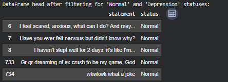 |

| Class Distribution | 
|--------------------|
| 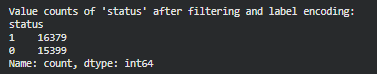 |

This near 50/50 split is beneficial for training as it means the model is not heavily biased towards one class. 

## Data Preprocessing 
Steps performed: 
* Text cleaning
* Label filtering to binary classes
* Train-test split
* TF-IDF vectorization

TF-IDF was chosen because 
* Performs well for sparse text data
* Works effectively with linear models
* Computationally efficient

## Feature Engineering
Text statements were transformed using:
* TF-IDF Vectorizer
* Sparse high-dimensional representation

| Data Shapes | 
|-------------|
| 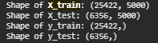 |

## Models Implemented

### Logistic Regression (Baseline)

Used as a baseline linear classifier.

Why:
* Performs well on TF-IDF text features
* Strong benchmark for comparison
* Simple and interpretable

| Logistic Regression Confusion Matrix| 
|-------------------------------------|
| 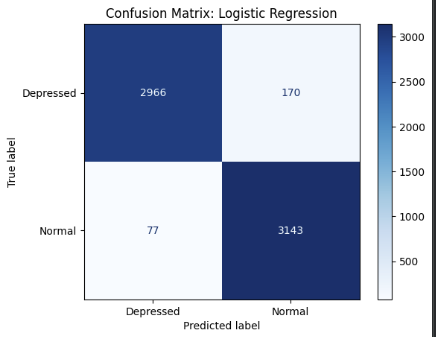 |

| Logistic Precision-Recall Curve | 
|---------------------------------|
| 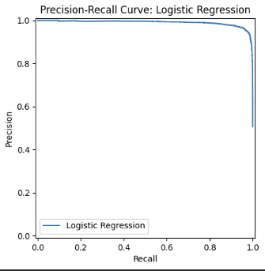 |

### Decision Tree Classifier

Includes hyperparameter tuning using GridSearchCV

Purpose: 
* Explore the non-linear decision boundaries
* Compare performance against the linear baseline

| Decision Tree Confusion Matrix| 
|-------------------------------|
| 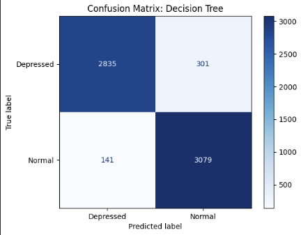 |

| Decision Tree Precision-Recall Curve| 
|-------------------------------------|
| 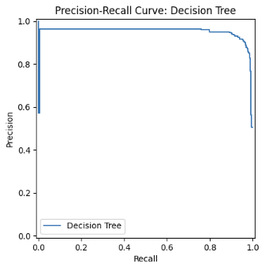 |

### Artificial Neural Network (ANN)

Architecture:
* Dense hidden layers
* ReLU activation
* Sigmoid output (binary classification)
* Early stopping to prevent overfitting

The ANN is included to test whether deeper nonlinear models outperform classical ML on TF-IDF features.

| ANN Confusion Matrix| 
|---------------------|
| 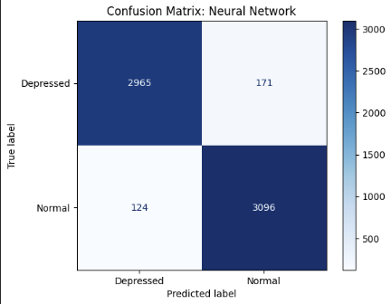 |

| ANN Precision-Recall Curve| 
|---------------------------|
| 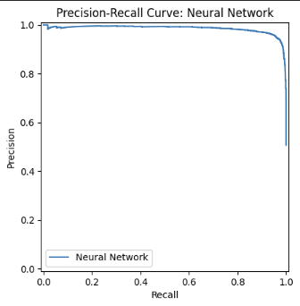 |

| ANN Training vs Validation Accuracy and Loss | 
|----------------------------------------------|
| 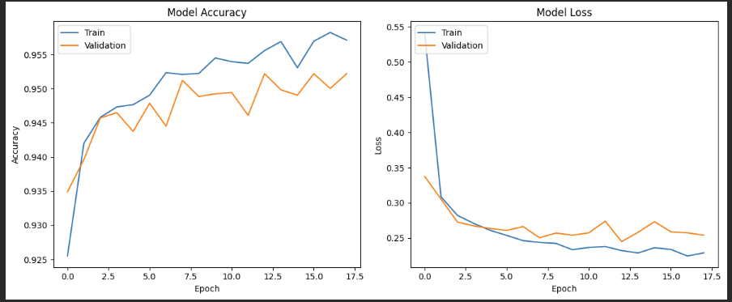 |

## Model Comparison

| Compare Model Accuracies | 
|--------------------------|
| 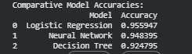 |

| Model               | Strengths                        | Observations                          |
| ------------------- | -------------------------------- | ------------------------------------- |
| Logistic Regression | Strong baseline, efficient       | Performs competitively on sparse text |
| Decision Tree       | Non-linear splits                | Risk of overfitting                   |
| ANN                 | Flexible representation learning | Limited improvement over linear model |

## Qualitative Testing on Custom Statements

To further evaluate real-world behavior, manually constructed example statements were passed through the trained models.

| Testing New Statements | 
|--------------------------|
| 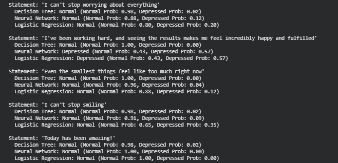 |

### Observations:

All models performed well on clearly positive statements, consistently predicting Normal with high confidence.

However, statements expressing subtle distress (e.g., worry or feeling overwhelmed) were often classified as Normal, even when a human interpretation might associate them with anxiety or emotional strain. This reflects a limitation of the binary setup (Normal vs. Depression), where the models are not trained to recognize other mental health states.

These results highlight how problem framing and label design directly shape what the model can and cannot detect.

## Error Analysis
* Common misclassifications occur in:
* Emotionally ambiguous statements
* Indirect expressions of distress
* Overlapping vocabulary between classes
* This highlights limitations of:
* Surface-level lexical features
* Binary psychological framing

## Limitations
* Binary simplification reduces psychological nuance
* TF-IDF ignores contextual meaning
* No transformer-based embeddings used
* Dataset labeling may contain bias
* Model is not suitable for clinical deployment
* This project is exploratory and educational in nature.

## Future Improvements
* Multiclass classification
* BERT / transformer embeddings
* Context-aware modeling
* Deployment as API or web application

## Technologies Used
* Python
* Pandas
* Scikit-learn
* TensorFlow / Keras
* Matplotlib / Seaborn

